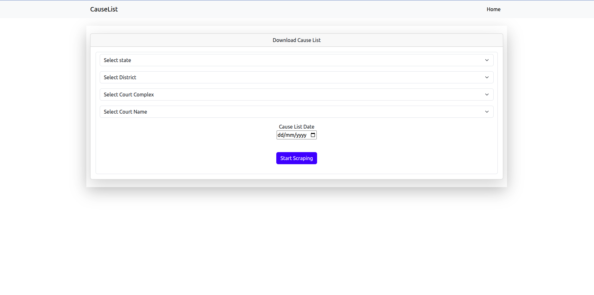
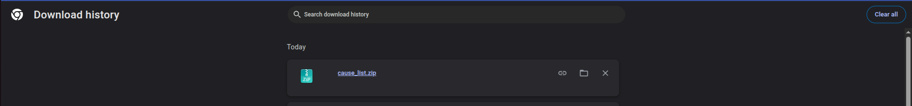

This is the home page or the ui where user select the required inputs

And when user click on start scraping button, It started scraping the cause list from the backend 

and these are the logs of the backend , where scraping is working 

If scraping completed it gets downloaded from the user browser.

